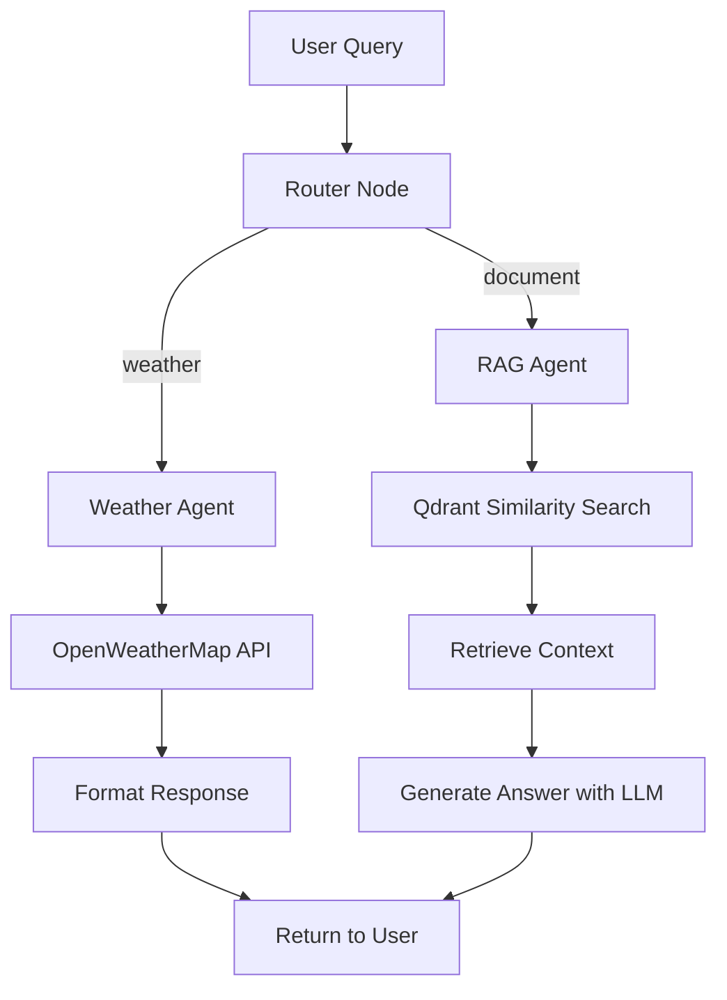

# AI Pipeline with LangGraph, LangChain & LangSmith

An intelligent AI pipeline that routes user queries to either a **Weather Agent** (using OpenWeatherMap API) or a **Document Q&A Agent** (using RAG with Qdrant vector store), built with LangGraph for orchestration and LangSmith for evaluation.


## 🌟 Features

- **Intelligent Query Routing**: LangGraph node that automatically classifies queries as weather-related or document-related
- **Weather Agent**: Fetches real-time weather data using OpenWeatherMap API
- **RAG Agent**: Answers questions from PDF documents using Retrieval-Augmented Generation
- **Vector Database**: Qdrant for efficient document embedding storage and similarity search
- **LLM Processing**: Groq (Llama 3.3 70B) - FREE and extremely fast inference
- **Embeddings**: HuggingFace sentence-transformers (runs locally, no API cost)
- **LangSmith Integration**: Full tracing and evaluation of LLM responses
- **Streamlit UI**: User-friendly chat interface with PDF upload capability
- **Comprehensive Tests**: Unit tests for API handling, LLM processing, and retrieval logic

## 🎥 Demo

### Weather Query
```
User: What's the weather in Mumbai?
→ Router classifies as "weather"
→ Weather Agent calls OpenWeatherMap API
→ LLM formats response with temperature, humidity, conditions
```

### Document Q&A (RAG)
```
User: [Uploads PDF] → What are the key points?
→ Router classifies as "document"
→ RAG Agent retrieves relevant chunks from Qdrant
→ LLM generates answer with source citations
```

## 🏗️ Architecture

```
┌─────────────────────────────────────────────────────────────────┐
│                        Streamlit UI                              │
│                    (Chat Interface + PDF Upload)                 │
└─────────────────────────────────────────────────────────────────┘
                                │
                                ▼
┌─────────────────────────────────────────────────────────────────┐
│                      LangGraph Pipeline                          │
│  ┌─────────────┐    ┌────────────────┐    ┌─────────────────┐   │
│  │   Router    │───▶│ Weather Agent  │───▶│ OpenWeatherMap  │   │
│  │   Node      │    └────────────────┘    └─────────────────┘   │
│  │             │    ┌────────────────┐    ┌─────────────────┐   │
│  │ (LLM-based) │───▶│   RAG Agent    │───▶│ Qdrant + Groq   │   │
│  └─────────────┘    └────────────────┘    └─────────────────┘   │
└─────────────────────────────────────────────────────────────────┘
                                │
                                ▼
┌─────────────────────────────────────────────────────────────────┐
│                     LangSmith Tracing                            │
│              (Evaluation & Response Monitoring)                  │
└─────────────────────────────────────────────────────────────────┘
```

### LangGraph Flow Diagram



## 📁 Project Structure

```
task-Langgraph/
├── src/
│   ├── __init__.py
│   ├── config.py              # Configuration & environment loading
│   ├── agents/
│   │   ├── __init__.py
│   │   ├── weather_agent.py   # OpenWeatherMap API integration
│   │   └── rag_agent.py       # PDF RAG implementation
│   ├── graph/
│   │   ├── __init__.py
│   │   ├── router.py          # LLM-based query classification
│   │   └── pipeline.py        # LangGraph workflow definition
│   ├── vectorstore/
│   │   ├── __init__.py
│   │   ├── embeddings.py      # HuggingFace embedding generation
│   │   └── qdrant_store.py    # Qdrant vector operations
│   └── utils/
│       ├── __init__.py
│       └── pdf_processor.py   # PDF loading & chunking
├── tests/
│   ├── __init__.py
│   ├── test_weather_api.py    # Weather API tests (8 tests)
│   ├── test_rag.py            # RAG & retrieval tests (12 tests)
│   └── test_pipeline.py       # Pipeline integration tests (12 tests)
├── app.py                     # Streamlit application
├── sample_document.pdf        # Sample PDF for testing
├── create_sample_pdf.py       # Script to generate sample PDF
├── requirements.txt           # Python dependencies
├── pytest.ini                 # Pytest configuration
├── .env.example               # Environment variables template
├── .gitignore
└── README.md
```

## 🚀 Setup Instructions

### Prerequisites

- Python 3.9+
- API Keys:
  - **Groq API Key** (FREE): https://console.groq.com
  - **OpenWeatherMap API Key** (FREE): https://openweathermap.org/api
  - **LangSmith API Key** (Optional): https://smith.langchain.com

### Installation

1. **Clone the repository**
   ```bash
   git clone <repository-url>
   cd task-Langgraph
   ```

2. **Create a virtual environment**
   ```bash
   python -m venv venv
   source venv/bin/activate  # On Windows: venv\Scripts\activate
   ```

3. **Install dependencies**
   ```bash
   pip install -r requirements.txt
   ```

4. **Configure environment variables**
   ```bash
   cp .env.example .env
   ```
   
   Edit `.env` with your API keys:
   ```env
   # Groq API (FREE - Llama 3.3 70B)
   GROQ_API_KEY=your_groq_api_key
   GROQ_MODEL=llama-3.3-70b-versatile
   
   # OpenWeatherMap API (FREE tier)
   OPENWEATHERMAP_API_KEY=your_openweathermap_api_key
   
   # LangSmith (Optional - for tracing/evaluation)
   LANGCHAIN_API_KEY=your_langsmith_api_key
   LANGCHAIN_TRACING_V2=true
   LANGCHAIN_PROJECT=ai-pipeline-assignment
   ```

## 🎮 Running the Application

### Start Streamlit UI

```bash
streamlit run app.py
```

The application will be available at `http://localhost:8501`

### Usage Examples

**Weather Queries:**
- "What's the weather in London?"
- "Is it raining in Tokyo?"
- "Temperature in New York City"

**Document Q&A:**
1. Upload a PDF using the sidebar
2. Click "Process PDF" to index the document
3. Ask questions:
   - "Summarize the main points"
   - "What does it say about machine learning?"
   - "Explain the key findings"

## 🧪 Running Tests

```bash
# Run all unit tests
pytest tests/ -v

# Run with coverage report
pytest tests/ --cov=src --cov-report=html

# Run only unit tests (skip integration)
pytest tests/ -v -m "not integration"
```

### Test Results

```
========================= test session starts ==========================
collected 36 items / 4 deselected / 32 selected

tests/test_pipeline.py::TestQueryRouter::test_classify_weather_query PASSED
tests/test_pipeline.py::TestQueryRouter::test_classify_document_query PASSED
tests/test_pipeline.py::TestQueryRouter::test_route_returns_string PASSED
tests/test_pipeline.py::TestAgentPipeline::test_pipeline_routes_to_weather PASSED
tests/test_pipeline.py::TestAgentPipeline::test_pipeline_routes_to_rag PASSED
tests/test_pipeline.py::TestAgentPipeline::test_pipeline_includes_sources_for_rag PASSED
tests/test_pipeline.py::TestAgentPipeline::test_pipeline_handles_weather_error PASSED
tests/test_pipeline.py::TestAgentPipeline::test_pipeline_handles_rag_error PASSED
... (24 more tests)

======================= 32 passed, 4 deselected ========================
```

### Test Coverage

| Module | Tests | Coverage |
|--------|-------|----------|
| Weather Agent | 8 | API handling, error cases, response formatting |
| RAG Agent | 12 | PDF processing, chunking, retrieval, context formatting |
| Pipeline | 12 | Router logic, agent selection, error handling |

## 📊 LangSmith Evaluation

When LangSmith is configured, all pipeline runs are automatically traced.

### Viewing Traces

1. Go to https://smith.langchain.com
2. Navigate to your project ("ai-pipeline-assignment")
3. View detailed traces for each query

### What's Traced

- **Router Decision**: Query classification (weather vs document)
- **LLM Calls**: Input/output for each LLM invocation
- **Latency**: Response times for each component
- **Token Usage**: LLM token consumption

## 🛠️ Technical Implementation

### LangGraph Pipeline

The pipeline uses LangGraph's `StateGraph` to orchestrate the agentic workflow:

```python
from langgraph.graph import StateGraph, END

# State definition
class AgentState(TypedDict):
    query: str
    route: str
    response: str
    sources: List[dict]

# Graph construction
workflow = StateGraph(AgentState)
workflow.add_node("router", router_node)
workflow.add_node("weather", weather_node)
workflow.add_node("rag", rag_node)
workflow.add_conditional_edges("router", route_decision, {
    "weather": "weather",
    "document": "rag"
})
workflow.add_edge("weather", END)
workflow.add_edge("rag", END)
```

### Router Node (Decision Making)

Uses LLM with structured output for reliable classification:

```python
class RouteDecision(BaseModel):
    route: Literal["weather", "document"]
    reasoning: str

router = llm.with_structured_output(RouteDecision)
```

### Vector Store (Qdrant)

```python
# In-memory Qdrant with HuggingFace embeddings
embeddings = HuggingFaceEmbeddings(model_name="all-MiniLM-L6-v2")
client = QdrantClient(":memory:")

# Similarity search
results = client.query_points(
    collection_name="pdf_documents",
    query=query_embedding,
    limit=4
)
```

### RAG Pipeline

```python
# PDF Processing
loader = PyPDFLoader(file_path)
documents = loader.load()
chunks = text_splitter.split_documents(documents)

# Embedding & Storage
embeddings = embed_documents(chunks)
qdrant.add_documents(chunks, embeddings)

# Retrieval & Generation
context = similarity_search(query, k=4)
response = llm.invoke(rag_prompt.format(context=context, question=query))
```

## 📝 Assignment Deliverables Checklist

- [x] Python code in GitHub repository
- [x] README.md with setup instructions and implementation details
- [x] LangGraph implementation with decision-making node
- [x] Weather API integration (OpenWeatherMap)
- [x] RAG implementation with Qdrant vector database
- [x] LangSmith integration for evaluation
- [x] Unit tests for API, LLM, and retrieval (32 tests passing)
- [x] Streamlit UI demo
- [ ] LangSmith logs/screenshots
- [ ] Loom video explaining results

## 🤝 Contributing

1. Fork the repository
2. Create a feature branch
3. Make your changes
4. Run tests: `pytest tests/`
5. Submit a pull request

## 📄 License

This project is created as part of an AI Engineer assignment.

---

**Built with ❤️ using LangChain, LangGraph, Groq, and Streamlit**
